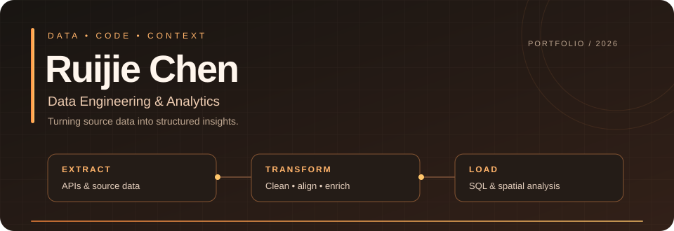

  

  <a href="#about">About</a> &nbsp;·&nbsp;
  <a href="#featured-project">Featured Project</a> &nbsp;·&nbsp;
  <a href="#tech-stack">Tech Stack</a> &nbsp;·&nbsp;
  <a href="#中文简介">中文简介</a> &nbsp;·&nbsp;
  <a href="mailto:1556034192@qq.com">Email</a>

## About

Hi, I'm **Ruijie Chen**, seeking **data analyst opportunities**. I use **Python and SQL** to clean and explore data, investigate patterns, and communicate findings through charts, maps and clear documentation.

- **Prepare:** clean, validate and combine datasets from multiple sources.
- **Analyse:** compare categories and regions, summarise data, and investigate patterns.
- **Communicate:** explain findings through visualisations, with clear assumptions and limitations.

**Contact / 联系邮箱:** [1556034192@qq.com](mailto:1556034192@qq.com)

## Featured Project

### [Australian Renewable Energy ETL Pipeline](https://github.com/RuijieChen2026/australian-renewable-energy-etl)

**Analysis question:** How do renewable energy projects differ across Australian states and energy sources?

Combined **CER, NGER and ABS** data to explore project distributions, supported by data cleaning, geocoding and PostgreSQL / PostGIS storage.

**Findings:** Within the project dataset, renewable energy projects were concentrated in **New South Wales and Queensland**, and **solar** was the most common energy source. Maps showed clustering in eastern and south-eastern Australia. These are descriptive findings from a historical snapshot, not causal conclusions or a current national census.

| Project dataset | Location matching | Analysis outputs |
| :--- | :--- | :--- |
| **157** CER renewable energy projects | **111** accepted matches · **70.7%** | State comparisons, energy-source charts and facility maps |

**My contribution:** CER data acquisition and cleaning, Google Maps geocoding with match-quality checks, and visualisation of project distributions by state, energy source and location.

Built collaboratively with **Vo Thu Nga Phan** and **S Parameswaran**. Metrics describe the project dataset; accepted geocoding matches are locality-level estimates, not verified precise facility locations.

**[Explore the repository →](https://github.com/RuijieChen2026/australian-renewable-energy-etl)** &nbsp; [Full project overview](https://github.com/RuijieChen2026/australian-renewable-energy-etl/blob/main/PROJECT_OVERVIEW.md) &nbsp; [Analysis notebook](https://github.com/RuijieChen2026/australian-renewable-energy-etl/blob/main/renewable_energy_analysis.ipynb)

## Tech Stack

  

## 中文简介

我是 **Ruijie Chen**，正在寻找**数据分析相关岗位**。我使用 **Python 和 SQL** 清洗、整合与探索数据，通过分类比较、区域分析和可视化回答问题，并清晰说明结果与局限。

在[澳大利亚可再生能源 ETL 数据管道](https://github.com/RuijieChen2026/australian-renewable-energy-etl)项目中，我负责 CER 数据获取与清洗、Google Maps 地理编码及可视化。分析重点是各州项目分布和能源类型差异：在项目数据快照中，项目主要集中在新南威尔士州和昆士兰州，太阳能是最常见的能源类型。ETL 与 PostgreSQL / PostGIS 为分析提供数据准备和存储支持。

[查看完整中英双语项目介绍 →](https://github.com/RuijieChen2026/australian-renewable-energy-etl/blob/main/PROJECT_OVERVIEW.md)

---

Python & SQL · Data Analysis · Visual Storytelling

